## css3图形

1. 正方形
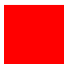

	```css
	
	#square{ width: 100px; height: 100px; background:red; }
	```
	
2. 长方形


	```css
	
	#rectangle{ width: 200px; height: 100px; background: red; }
	```
	
3. 圆
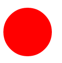

	```css
	
	#circle {
	 width: 100px; height: 100px; 
	 background: red; 
	 -moz-border-radius: 50px; 
	 -webkit-border-radius: 50px; 
	 border-radius: 50px; 
	 }
	```
	
4. 椭圆


	```css
	
	#oval { 
	width: 200px; height: 100px; 
	background: red; 
	-moz-border-radius: 100px / 50px; 
	-webkit-border-radius: 100px / 50px; 
	border-radius: 100px / 50px; }
	```
	
5. 三角形向上
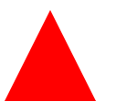

	```css
	
	#triangle-up { 
	width: 0; height: 0; 
	border-left: 50px solid transparent; 
	border-right: 50px solid transparent; 
	border-bottom: 100px solid red; }
	```
	
6. 三角形向下
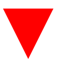

	```css
	
	#triangle-down {
	    width: 0;
	    height: 0;
	    border-left: 50px solid transparent;
	    border-right: 50px solid transparent;
	    border-top: 100px solid red;
	}
	```
	
7. 三角形向左
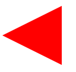

	```css
	
	#triangle-left {
	    width: 0;
	    height: 0;
	    border-top: 50px solid transparent;
	    border-right: 100px solid red;
	    border-bottom: 50px solid transparent;
	}
	```
	
8. 三角形向右


	```css
	
	#triangle-right {
	    width: 0;
	    height: 0;
	    border-top: 50px solid transparent;
	    border-left: 100px solid red;
	    border-bottom: 50px solid transparent;
	}
	```
	
9. 三角形（左上角）
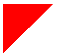

	```css
	
	#triangle-topleft { 
	width: 0; height: 0;
	 border-top: 100px solid red; 
	 border-right: 100px solid transparent;
	  }
	```
	
10. 三角形（右上角）
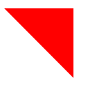

	```css
	
	#triangle-topright { 
	width: 0; height: 0; 
	border-top: 100px solid red; 
	border-left: 100px solid transparent; 
	}
	```
	
11. 三角形（左下角）
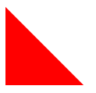

	```css
	
	#triangle-bottomleft { 
	width: 0; height: 0; 
	border-bottom: 100px solid red; 
	border-right: 100px solid transparent; 
	}
	```
	
12. 三角形（右下角）	
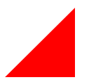

	```css
	
	#triangle-bottomright { 
	width: 0; height: 0; 
	border-bottom: 100px solid red; 
	border-left: 100px solid transparent; 
	}
	```
	
13. 弯曲的尾巴箭头


	```css
	
	#curvedarrow { 
	position: relative; width: 0; height: 0; 
	border-top: 9px solid transparent; 
	border-right: 9px solid red; 
	-webkit-transform: rotate(10deg); 
	-moz-transform: rotate(10deg); 
	-ms-transform: rotate(10deg); 
	-o-transform: rotate(10deg); 
	}
	#curvedarrow:after { 
	content: ""; position: absolute; 
	border: 0 solid transparent; 
	border-top: 3px solid red; 
	border-radius: 20px 0 0 0; 
	top: -12px; left: -9px; 
	width: 12px; height: 12px; 
	-webkit-transform: rotate(45deg); 
	-moz-transform: rotate(45deg); 
	-ms-transform: rotate(45deg); 
	-o-transform: rotate(45deg); 
	}
	```
	
14. 梯形
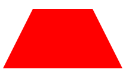

	```css
	
	#trapezoid { 
	border-bottom: 100px solid red; 
	border-left: 50px solid transparent; 
	border-right: 50px solid transparent; 
	height: 0; width: 100px; 
	}
	```
	
15. 平行四边形
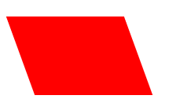

	```css
	
	#parallelogram { 
	width: 150px; height: 100px; 
	-webkit-transform: skew(20deg); 
	-moz-transform: skew(20deg); 
	-o-transform: skew(20deg); 
	background: red; position: relative; 
	left: 20px; 
	}
	```
	
16. 六角星
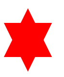

	```css
	
	#star-six { 
	width: 0; height: 0; 
	border-left: 50px solid transparent; 
	border-right: 50px solid transparent; 
	border-bottom: 100px solid red; 
	position: relative; 
	} 
	#star-six:after { 
	width: 0; height: 0; 
	border-left: 50px solid transparent; 
	border-right: 50px solid transparent; 
	border-top: 100px solid red; 
	position: absolute; 
	content: ""; 
	top: 30px; 
	left: -50px; 
	}
	```
	
17. 五角星


	```css
	
	#star-five { 
	margin: 50px 0; 
	position: relative; 
	display: block; 
	color: red; 
	width: 0px; height: 0px; 
	border-right: 100px solid transparent; 
	border-bottom: 70px solid red; 
	border-left: 100px solid transparent; 
	-moz-transform: rotate(35deg); 
	-webkit-transform: rotate(35deg); 
	-ms-transform: rotate(35deg); 
	-o-transform: rotate(35deg); 
	} 
	#star-five:before { 
	border-bottom: 80px solid red; 
	border-left: 30px solid transparent; 
	border-right: 30px solid transparent; 
	position: absolute; 
	height: 0; width: 0; 
	top: -45px; left: -65px; 
	display: block; 
	content: ''; 
	-webkit-transform: rotate(-35deg); 
	-moz-transform: rotate(-35deg); 
	-ms-transform: rotate(-35deg); 
	-o-transform: rotate(-35deg); 
	} 
	#star-five:after { 
	position: absolute; 
	display: block; 
	color: red; 
	top: 3px; left: -105px; 
	width: 0px; height: 0px; 
	border-right: 100px solid transparent; 
	border-bottom: 70px solid red; 
	border-left: 100px solid transparent; 
	-webkit-transform: rotate(-70deg); 
	-moz-transform: rotate(-70deg); 
	-ms-transform: rotate(-70deg); 
	-o-transform: rotate(-70deg); 
	content: ''; 
	}
	```
	
18. 五边形
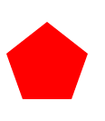

	```css
	
	#pentagon { 
	position: relative; 
	width: 54px; 
	border-width: 50px 18px 0; 
	border-style: solid; 
	border-color: red transparent; 
	} 
	#pentagon:before { 
	content: ""; 
	position: absolute; 
	height: 0; width: 0; 
	top: -85px; left: -18px; 
	border-width: 0 45px 35px; 
	border-style: solid; 
	border-color: transparent transparent red; 
	}
	```
	
19. 六边形
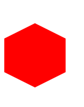

	```css
	
	#hexagon { 
	width: 100px; height: 55px; 
	background: red; 
	position: relative; 
	} 
	#hexagon:before { 
	content: ""; 
	position: absolute; 
	top: -25px; left: 0; 
	width: 0; height: 0; 
	border-left: 50px solid transparent; 
	border-right: 50px solid transparent; 
	border-bottom: 25px solid red; 
	} 
	#hexagon:after { 
	content: ""; 
	position: absolute; 
	bottom: -25px; left: 0; 
	width: 0; height: 0; 
	border-left: 50px solid transparent; 
	border-right: 50px solid transparent; 
	border-top: 25px solid red; 
	}
	```
	
20. 八角形
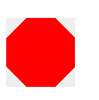

	```css
	
	#octagon { 
	width: 100px; height: 100px; 
	background: red; 
	position: relative; 
	} 
	#octagon:before { 
	content: ""; 
	position: absolute; 
	top: 0; left: 0; 
	border-bottom: 29px solid red; 
	border-left: 29px solid #eee; 
	border-right: 29px solid #eee; 
	width: 42px; height: 0; 
	} 
	#octagon:after { 
	content: ""; 
	position: absolute; 
	bottom: 0; left: 0; 
	border-top: 29px solid red; 
	border-left: 29px solid #eee; 
	border-right: 29px solid #eee; 
	width: 42px; height: 0; 
	}
	```
	
21. 心形
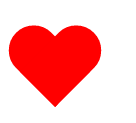

	```css
	
	#heart { 
	position: relative; 
	width: 100px; height: 90px; 
	} 
	#heart:before, 
	#heart:after { 
	position: absolute; 
	content: ""; 
	left: 50px; top: 0; 
	width: 50px; height: 80px; 
	background: red; 
	-moz-border-radius: 50px 50px 0 0; 
	border-radius: 50px 50px 0 0; 
	-webkit-transform: rotate(-45deg); 
	-moz-transform: rotate(-45deg); 
	-ms-transform: rotate(-45deg); 
	-o-transform: rotate(-45deg); 
	transform: rotate(-45deg); 
	-webkit-transform-origin: 0 100%; 
	-moz-transform-origin: 0 100%; 
	-ms-transform-origin: 0 100%; 
	-o-transform-origin: 0 100%; 
	transform-origin: 0 100%; 
	} 
	#heart:after { 
	left: 0; 
	-webkit-transform: rotate(45deg); 
	-moz-transform: rotate(45deg); 
	-ms-transform: rotate(45deg); 
	-o-transform: rotate(45deg); 
	transform: rotate(45deg); 
	-webkit-transform-origin: 100% 100%; 
	-moz-transform-origin: 100% 100%; 
	-ms-transform-origin: 100% 100%; 
	-o-transform-origin: 100% 100%; 
	transform-origin :100% 100%; 
	}
	```
	
22. 无穷
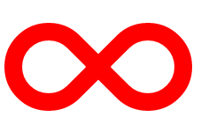

	```css
	
	#infinity { 
	position: relative; 
	width: 212px; height: 100px; 
	} 
	#infinity:before, 
	#infinity:after { 
	content: ""; 
	position: absolute; 
	top: 0; left: 0; 
	width: 60px; height: 60px; 
	border: 20px solid red; 
	-moz-border-radius: 50px 50px 0 50px; 
	border-radius: 50px 50px 0 50px; 
	-webkit-transform: rotate(-45deg); 
	-moz-transform: rotate(-45deg); 
	-ms-transform: rotate(-45deg); 
	-o-transform: rotate(-45deg); 
	transform: rotate(-45deg); 
	} 
	#infinity:after { 
	left: auto; right: 0; 
	-moz-border-radius: 50px 50px 50px 0; 
	border-radius: 50px 50px 50px 0; 
	-webkit-transform: rotate(45deg); 
	-moz-transform: rotate(45deg); 
	-ms-transform: rotate(45deg); 
	-o-transform: rotate(45deg); 
	transform: rotate(45deg); 
	}
	```
	
23. 菱形
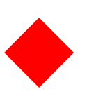

	```css
	
	#diamond { 
	width: 0; height: 0; 
	border: 50px solid transparent; 
	border-bottom-color: red; 
	position: relative; 
	top: -50px; 
	} 
	#diamond:after { 
	content: ''; 
	position: absolute; 
	left: -50px; top: 50px; 
	width: 0; height: 0; 
	border: 50px solid transparent; 
	border-top-color: red; 
	}
	```
	
24. 盾牌
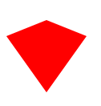

	```css
	
	#diamond-shield { 
	width: 0; height: 0; 
	border: 50px solid transparent; 
	border-bottom: 20px solid red; 
	position: relative; top: -50px; 
	} 
	#diamond-shield:after { 
	content: ''; 
	position: absolute; 
	left: -50px; top: 20px; 
	width: 0; height: 0;
	border: 50px solid transparent; 
	border-top: 70px solid red; 
	}
	```
	
25. 菱形
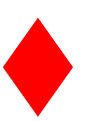

	```css
	
	#diamond-narrow { 
	width: 0; height: 0; 
	border: 50px solid transparent; 
	border-bottom: 70px solid red; 
	position: relative; top: -50px; 
	} 
	#diamond-narrow:after { 
	content: ''; 
	position: absolute; 
	left: -50px; top: 70px; 
	width: 0; height: 0; 
	border: 50px solid transparent; 
	border-top: 70px solid red; 
	}
	```
	
26. cut diamond
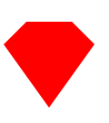

	```css
	
	#cut-diamond { 
	border-style: solid; 
	border-color: transparent transparent red transparent; 
	border-width: 0 25px 25px 25px; 
	height: 0; width: 50px; 
	position: relative; 
	margin: 20px 0 50px 0; 
	} 
	#cut-diamond:after { 
	content: ""; 
	position: absolute; 
	top: 25px; left: -25px; 
	width: 0; height: 0; 
	border-style: solid; 
	border-color: red transparent transparent transparent; 
	border-width: 70px 50px 0 50px; 
	}
	```
	
27. egg
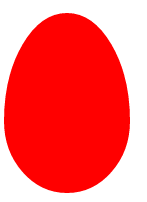

	```css
	
	#egg { 
	display:block; 
	width: 126px; height: 180px; 
	background-color: red; 
	-webkit-border-radius: 63px 63px 63px 63px / 108px 108px 72px 72px; 
	border-radius: 50% 50% 50% 50% / 60% 60% 40% 40%; 
	}
	```
	
28. pac-man
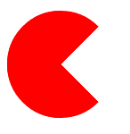

	```css
	
	#pacman { 
	width: 0px; height: 0px; 
	border-right: 60px solid transparent; 
	border-top: 60px solid red; 
	border-left: 60px solid red; 
	border-bottom: 60px solid red; 
	border-top-left-radius: 60px; 
	border-top-right-radius: 60px; 
	border-bottom-left-radius: 60px; 
	border-bottom-right-radius: 60px; 
	}
	```
	
29. talk bubble
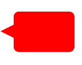

	```css
	
	#talkbubble { 
	width: 120px; height: 80px; 
	background: red; 
	position: relative; 
	left: 20px; 
	-moz-border-radius: 10px; 
	-webkit-border-radius: 10px; 
	border-radius: 10px; 
	} 
	#talkbubble:before { 
	content:""; 
	position: absolute; 
	right: 100%; top: 26px; 
	width: 0; height: 0; 
	border-top: 13px solid transparent; 
	border-right: 26px solid red; 
	border-bottom: 13px solid transparent; 
	}
	```
	
30. point burst
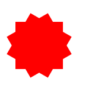

	```css
	
	#burst-12 { 
	background: red; 
	width: 80px; height: 80px; 
	position: relative; 
	left: 20px; 
	text-align: center; 
	} 
	#burst-12:before, 
	#burst-12:after { 
	content: ""; 
	position: absolute; 
	top: 0; left: 0; 
	height: 80px; width: 80px; 
	background: red; 
	} 
	#burst-12:before { 
	-webkit-transform: rotate(30deg); 
	-moz-transform: rotate(30deg); 
	-ms-transform: rotate(30deg); 
	-o-transform: rotate(30deg); 
	} 
	#burst-12:after { 
	-webkit-transform: rotate(60deg); 
	-moz-transform: rotate(60deg); 
	-ms-transform: rotate(60deg); 
	-o-transform: rotate(60deg); 
	}
	```
	
31. point burst
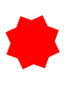

	```css
	
	#burst-8 { 
	background: red; 
	width: 80px; height: 80px; 
	position: relative; 
	left: 20px; 
	text-align: center; 
	-webkit-transform: rotate(20deg); 
	-moz-transform: rotate(20deg); 
	-ms-transform: rotate(20deg); 
	-o-transform: rotate(20eg); 
	} 
	#burst-8:before { 
	content: ""; 
	position: absolute; 
	top: 0; left: 0; 
	height: 80px; width: 80px; 
	background: red; 
	-webkit-transform: rotate(135deg); 
	-moz-transform: rotate(135deg); 
	-ms-transform: rotate(135deg); 
	-o-transform: rotate(135deg); 
	}
	```
	
32. yin yang
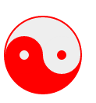

	```css
	
	#yin-yang { 
	width: 96px; height: 48px; 
	background: #eee; 
	border-color: red; 
	border-style: solid;
    border-width: 2px 2px 50px 2px; 
    border-radius: 100%; 
    position: relative; 
    } 
    #yin-yang:before { 
    content: ""; 
    position: absolute; 
    top: 50%; left: 0; 
    background: #eee; 
    border: 18px solid red; 
    border-radius: 100%; 
    width: 12px; height: 12px; 
    } 
    #yin-yang:after { 
    content: ""; 
    position: absolute; 
    top: 50%; left: 50%; 
    background: red; 
    border: 18px solid #eee; 
    border-radius:100%; 
    width: 12px; height: 12px; 
    }
	```
	
33. badge ribbon


	```css
	
	#badge-ribbon { 
	position: relative; 
	background: red; 
	height: 100px; width: 100px; 
	-moz-border-radius: 50px; 
	-webkit-border-radius: 50px; 
	border-radius: 50px; 
	} 
	#badge-ribbon:before, 
	#badge-ribbon:after { 
	content: ''; 
	position: absolute; 
	border-bottom: 70px solid red; 
	border-left: 40px solid transparent; 
	border-right: 40px solid transparent; 
	top: 70px; left: -10px; 
	-webkit-transform: rotate(-140deg); 
	-moz-transform: rotate(-140deg); 
	-ms-transform: rotate(-140deg); 
	-o-transform: rotate(-140deg); 
	} 
	#badge-ribbon:after { 
	left: auto; right: -10px; 
	-webkit-transform: rotate(140deg); 
	-moz-transform: rotate(140deg); 
	-ms-transform: rotate(140deg); 
	-o-transform: rotate(140deg); 
	}
	```
	
34. space invader


	```css
	
	#space-invader{ 
	box-shadow: 0 0 0 1em red, 0 1em 0 1em red, -2.5em 1.5em 0 .5em red, 2.5em 1.5em 0 .5em red, -3em -3em 0 0 red, 3em -3em 0 0 red, -2em -2em 0 0 red, 2em -2em 0 0 red, -3em -1em 0 0 red, -2em -1em 0 0 red, 2em -1em 0 0 red, 3em -1em 0 0 red, -4em 0 0 0 red, -3em 0 0 0 red, 3em 0 0 0 red, 4em 0 0 0 red, -5em 1em 0 0 red, -4em 1em 0 0 red, 4em 1em 0 0 red, 5em 1em 0 0 red, -5em 2em 0 0 red, 5em 2em 0 0 red, -5em 3em 0 0 red, -3em 3em 0 0 red, 3em 3em 0 0 red, 5em 3em 0 0 red, -2em 4em 0 0 red, -1em 4em 0 0 red, 1em 4em 0 0 red, 2em 4em 0 0 red; 
	background: red; 
	width: 1em; height: 1em; 
	overflow: hidden; 
	position: relative; 
	left: 40px; 
	margin: 50px 0 70px 65px; 
	}
	```
	
35. tv screen
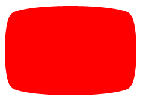

	```css
	
	#tv { 
	position: relative; 
	left: 10px; 
	width: 200px; height: 150px; 
	margin: 20px 0; 
	background: red;
	 border-radius: 50% / 10%; 
	 color: white; 
	 text-align: center; 
	 text-indent: .1em; 
	 } 
	 #tv:before { 
	 content: ''; 
	 position: absolute; 
	 top: 10%; bottom: 10%; 
	 right: -5%; left: -5%; 
	 background: inherit; 
	 border-radius: 5% / 50%; 
	 }
	```
	
36. chevron


	```css
	
	#chevron { 
	position: relative; 
	text-align: center; 
	padding: 12px; 
	margin-bottom: 6px; 
	height: 60px; 
	width: 200px; 
	} 
	#chevron:before { 
	content: ''; 
	position: absolute; 
	top: 0; left: 0; 
	height: 100%; width: 51%; 
	background: red; 
	-webkit-transform: skew(0deg, 6deg); 
	-moz-transform: skew(0deg, 6deg); 
	-ms-transform: skew(0deg, 6deg); 
	-o-transform: skew(0deg, 6deg); 
	transform: skew(0deg, 6deg); 
	} 
	#chevron:after { 
	content: ''; 
	position: absolute; 
	top: 0; right: 0; 
	height: 100%; width: 50%; 
	background: red; 
	-webkit-transform: skew(0deg, -6deg); 
	-moz-transform: skew(0deg, -6deg); 
	-ms-transform: skew(0deg, -6deg); 
	-o-transform: skew(0deg, -6deg); 
	transform: skew(0deg, -6deg); 
	}​
	```
	
37. moon


	```css
	
	#moon { 
	width: 80px; height: 80px; 
	border-radius: 50%; 
	box-shadow: 15px 15px 0 0 red; 
	position: relative; top: -15px; 
	}
	```
	
38. flag


	```css
	
	#flag { 
	width: 110px; height: 56px; 
	padding-top: 15px; 
	position: relative; 
	background: red; 
	color: white; 
	font-size: 11px; 
	letter-spacing: 0.2em; 
	text-align: center; 
	text-transform: uppercase; 
	} 
	#flag:after { 
	content: ""; 
	position: absolute; 
	left: 0; bottom: 0;
	 width: 0; height: 0; 
	 border-bottom: 13px solid #eee; 
	 border-left: 55px solid transparent; 
	 border-right: 55px solid transparent; 
	 }
	```
	
39. cone
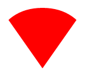

	```css
	
	#cone { 
	width: 0; height: 0; 
	border-left: 70px solid transparent;
	border-right: 70px solid transparent; 
	border-top: 100px solid red; 
	-moz-border-radius: 50%; 
	-webkit-border-radius: 50%; 
	border-radius: 50%; 
	}
	```
	
40. cross
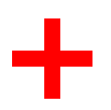

	```css
	
	#cross { 
	background: red; 
	height: 100px; 
	position: relative; 
	left:50px; 
	width: 20px; 
	} 
	#cross:after { 
	background: red; 
	content: ""; 
	height: 20px; 
	left: -40px; 
	position: absolute; 
	top: 40px; 
	width: 100px; 
	}
	```
	
41. base
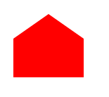

	```css
	
	#base { 
	background: red; 
	display: inline-block; 
	height: 55px; 
	margin-left: 20px; 
	margin-top: 55px; 
	position: relative; 
	width: 100px; 
	} 
	#base:before { 
	border-bottom: 35px solid red; 
	border-left: 50px solid transparent; 
	border-right: 50px solid transparent; 
	content: ""; 
	height: 0; left: 0; 
	position: absolute; 
	top: -35px; width: 0; 
	}
	```
	
42. facebook


	```css
	
	#facebook { 
	background: red; 
	text-indent: -999em; 
	width: 100px; height: 110px; 
	border-radius: 5px; 
	position: relative; 
	overflow: hidden; 
	border: 15px solid red;
	border-bottom: 0; 
	} 
	#facebook::before { 
	content: "/20"; 
	position: absolute; 
	background: red; 
	width: 40px; height: 90px; 
	bottom: -30px; right: -37px; 
	border: 20px solid #eee; 
	border-radius: 25px; 
	} 
	#facebook::after { 
	content: "/20"; 
	position: absolute; 
	width: 55px; 
	top: 50px; height: 20px; 
	background: #eee; 
	right: 5px; 
	}
	```